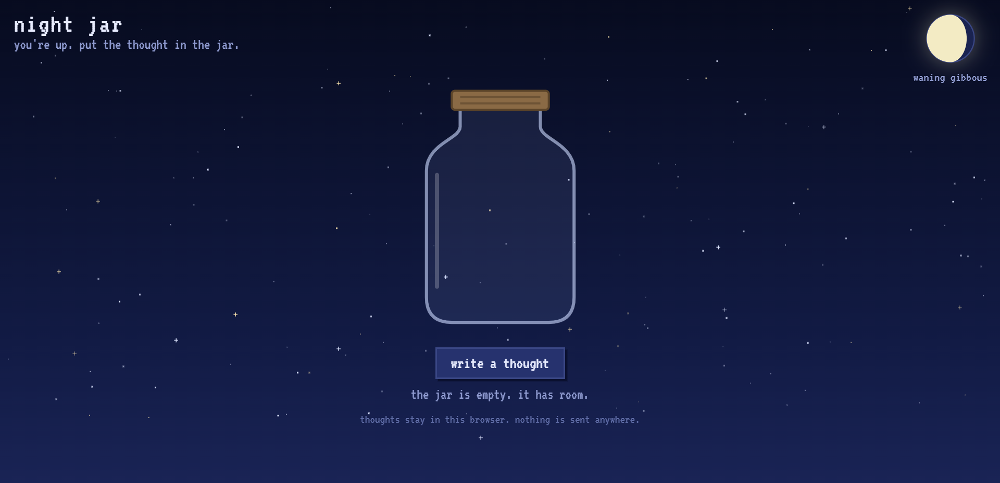
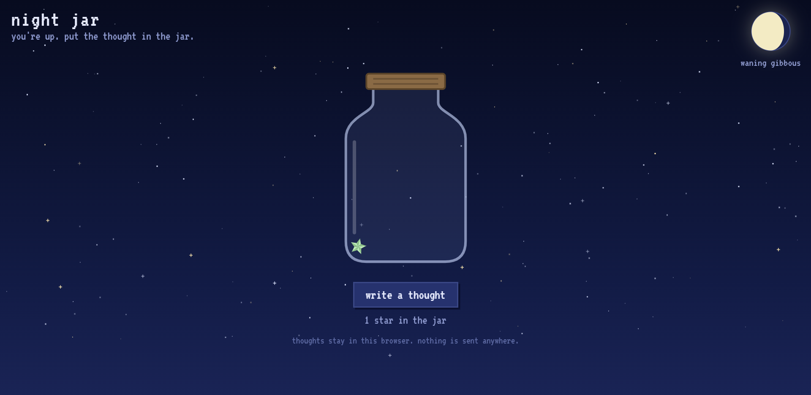
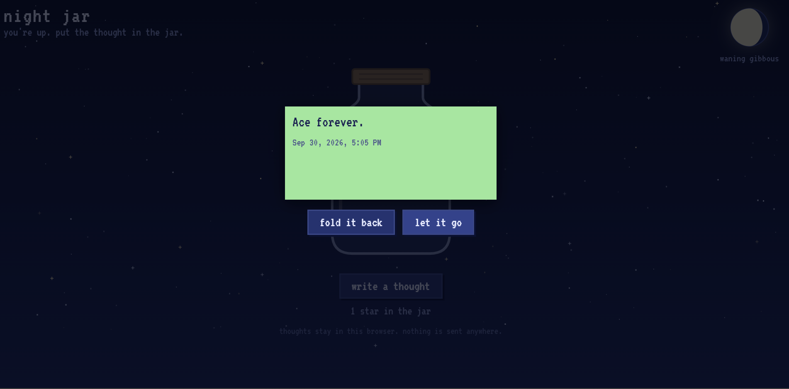

# night jar

> you're up. put the thought in the jar.

  

Night Jar is a small private space for the thoughts that show up when you're awake at night.

Write something down, fold it into a paper star, and let it fall into the jar.

Nothing is sent anywhere.  
There are no accounts.  
There is no feed.

It's just your jar.

---
## the idea

I wanted to make something that didn't really need to exist.

Not another productivity app.  
Not another social platform.  
Not another journal with a hundred settings.

Just a tiny nighttime space where you can put a thought somewhere and leave it there.

**Write it. Fold it. Put it away.**

---

## the experience

  

### 01 — write a thought

Click **"write a thought"**, write whatever is on your mind, and choose one of six paper colours.

Thoughts can be up to 400 characters.

Then comes the fun part.

### 02 — fold it

The paper doesn't just disappear into the jar.

It folds.

First in half, then from the side, then once more into a strip. Each fold reveals the darker back of the paper before the strip turns into a small paper star.

The star then flies into the jar.

### 03 — keep it

Your stars stay in the jar.

The latest 48 stars are displayed inside it, with slightly different positions and rotations so the jar doesn't look perfectly arranged.

Every saved thought remains stored even when it isn't one of the 48 currently displayed stars.

### 04 — open it again

  

Click a star and it comes back out.

It turns back into a strip and unfolds into the original paper, showing the thought and the date it was written.

From there, you have two choices:

**fold it back**  
Return the thought to the jar.

**let it go**  
Let the thought float away and delete it.

---

## the night sky

The background isn't just a static image.

The sky is drawn on a canvas with:

- Twinkling stars
- Occasional shooting stars
- A moon showing its current phase
- The name of the current moon phase
The moon phase is calculated from the current date, so the moon changes over time rather than always showing the same illustration.

---

## privacy

Night Jar is intentionally private.

Your thoughts are saved locally in your browser using browser storage.

Nothing is uploaded to a server.

There are:

- No accounts
- No login
- No backend
- No public feed
- No data collection

Your thoughts stay in that browser on that device.

That also means they can be lost if you:

- Clear the site's stored data
- Use a private/incognito window
- Switch browsers
- Switch devices

It's a trade-off I wanted for the first version: **privacy without needing an account.**

---

## how it's built

Night Jar is built with plain HTML, CSS and JavaScript.

No framework. No backend. Just the browser.

### `index.html`

The structure of the experience:

- Night sky canvas
- Moon
- Jar
- Write-a-thought interface
- Reading interface
- Controls and status text

### `style.css`

The visual system:

- Pixel-style typography
- Night sky
- Jar illustration
- Buttons
- Paper colours
- Fold states
- Star visuals
- Animations

### `script.js`

The behaviour behind everything:

- Moon phase calculation
- Star generation
- Jar positioning
- Local storage
- Writing and saving thoughts
- Paper folding
- Star creation
- Star-to-paper unfolding
- Re-folding
- Releasing thoughts
- Twinkling stars
- Shooting stars
- Reduced-motion behaviour

---

## a few details

- Thoughts are capped at **400 characters**
- The jar displays up to **48 stars at once**
- Older thoughts are still saved
- Paper stars have slightly random positions and rotations
- Each thought keeps its date
- The moon reflects the current lunar phase
- The sky respects reduced-motion settings
- Everything works entirely in the browser

## what's next

The first version is deliberately small.

Some things I'd like to explore later:

- **Export / import** so a jar can be backed up
- **Cross-device storage** if a private server-backed version ever makes sense
- The original idea of a public **"release to the sky"** mode
- Moderation if public thoughts are ever introduced
- A soft sound when a star drops into the jar
- More tiny nighttime details
- A browser tab title that changes at night

For now, though, the jar stays private.

## why "night jar"?

Because sometimes the best place for a thought is somewhere you don't have to do anything with it.

Write it down.

Fold it up.

Put it in the jar.

And go back to sleep.

**made with curiosity — AR✰**

